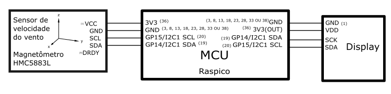

# MÓDULO DE VELOCIDADE DO VENTO
O módulo de velocidade do vento faz parte do projeto de estação meteorológica no âmbito da disciplina de Laboratorio Experimental de Campus Inteligente (IE321K).

O sistema de velocidade de vento usa o chip HMC5883L que contem um sensor magnético de baixo campo, um ADC de 12-bits, e interface de comunicação I2C que facilita a leitura do mesmo. Este chip tem o endereço em decimal: 60 (0x3C).

Este sistema fica dentro de uma placa impressa que facilita a comunicação com qualquer outro microcontrolador que possua comunicação I2C e trabalhe com 3.3V de alimentação.

Nesta caso foi escolhido o microcontrolador Raspberry Pi Pico e o lenguagem MicroPython.

## Diagrama de blocos
O seguinte diagrama apresenta as conexões dos subsistemas eletrónicos do modulo de velocidade do vento.

