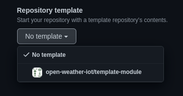
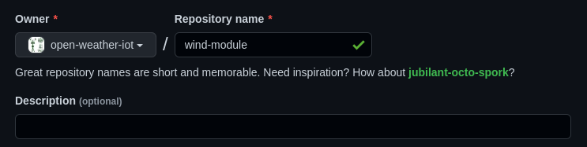

# MÓDULO DE VELOCIDADE DO VENTO
O módulo de velocidade do vento faz parte do projeto de estação meteorológica no âmbito da disciplina de Laboratorio Experimental de Campus Inteligente (IE321K).
O sistema de velocidade de vento contem o chip HMC5883L que contem um sensor magnético de baixo campo, um ADC de 12-bits, e interface de comunicação I2C que facilita a leitura do mesmo. Este chip tem o endereço em decimal: 60 (0x3C)


## Utilizando esse template
Para criar um novo módulo, siga os seguintes passos:
- Crie um repositório no GitHub nesta organização (`open-weather-iot`)
- Selecione o template `template-module`


- Dê um nome no formato `{sensor}-module`. Exemplo: `temperature-module`


- Não é necessário escrever uma descrição
- Deixe o projeto público. **Não faça upload de nenhum arquivo com informações sensíveis**


Após a inicialização do repositório:
- Reescreva o arquivo README.md com a descrição do projeto, incluindo o que é, informações necessárias, detalhes de execução e o restante que julgar pertinente.
- Inclua os arquivos necessários nas pastas descritas em na seção seguinte ([Organização de pastas e arquivos](#organizacao))

## Organização de pastas e arquivos <a id="organizacao"></a>
- `altium/`: arquivos do Altium
- `documents/`: especificações e PDFs utilizados para o desenvolvimento do sub-projeto
- `gerber_files/`: export de arquivos Gerber
- `img/`: imagens utilizadas na descrição do README.md
- `src/`: diretório do código-fonte. Todo código deverá ser colocado aqui, exceto quando é utilizado exclusivamente para testes
  - `example.py`: módulo de sensor exemplo
- `test/`: diretório com os arquivos para execução de testes
  - `main.py`: arquivo principal da rotina de execução de testes. Importa as classes e funções do diretório do código-fonte (`src/`)
- `util/`: códigos comuns utilizados por vários módulos de sensores ("utilitários").
  - `bus.py`: utilitário de barramentos SPI, Serial e I2C

Os arquivos `.gitkeep` existem nas pastas vazias para que elas sejam reconhecidas pelo git e incluídas no template. Após popular seu conteúdo, esses arquivos devem ser removidos.

## Base para uma classe de sensor
A base para um sensor é uma classe, a qual obedece aos seguintes métodos (funções):
- `__init__(self, *, ...)`: o construtor da classe deve receber os parâmetros nomeados necessários e o barramento utilizado (seja SPI, Serial ou I2C)
- `setup(self)` (**opcional**): contém as rotinas de inicialização do módulo do sensor, caso necessário
- `read(self)` (**obrigatório**): retorna um dicionário com as seguintes chaves:
  - `raw`: contém um dicionário com os valores puros que foram lidos do sensor que se está trabalhando
  - `value`: representa o valor final após conversão de unidades para ser apresentado diretamente ao usuário
  - `unit`: unidade de medida do campo `value`. Exemplo: `'Celsius'`

```py
class Example:
    # deve receber os parâmetros nomeados necessários e o barramento utilizado (seja SPI, Serial ou I2C)
    def __init__(self, *, i2c_bus):
        self.i2c_bus = i2c_bus
        # ...

    # método **OPCIONAL** da classe que realiza a inicialização do sensor
    def setup(self):
        pass

    # método **OBRIGATÓRIO** da classe que realiza leituras do sensor
    def read(self):
        return { 'raw': {}, 'value': 0.0, 'unit': '' }

```

## Utilitários
Alguns utilitários básicos são definidos na pasta `util/`.

### `bus.py`
Utilitário de barramentos SPI, Serial e I2C.

A classe respectiva para o barramento SPI obedece à seguinte especificação:
- construtor `SPI(port)`:
- `select()`: ativa o dispositivo SPI
- `deselect()`: desativa o dispositivo SPI
- `read(nbytes, *, auto_select=False)`: lê a quantidade `nbytes` de bytes do dispositivo SPI. Retorna um objeto `bytes` com o dado que foi lido.
- `write(buf, *, auto_select=False)`: Escreve os bytes contidos em `buf`. Retorna `None`.
- `_spi`: Atributo utilizado internamente que armazena a instância `machine.SPI`. Não é recomendável utilizar diretamente esse atributo, exceto nos casos de bibliotecas de componentes que recebem uma instância `machine.SPI`.
- `_cs_pin`: Atributo utilizado internamente que armazena o número do pino de *chip select*. Não é recomendável utilizar diretamente esse atributo, exceto nos casos de bibliotecas de componentes que recebem o número do pino de *chip select*.
- `_cs`: Atributo utilizado internamente que armazena a instância `machine.Pin` (*output*) do *chip select*. Não é recomendável utilizar diretamente esse atributo, exceto nos casos de bibliotecas de componentes que recebem uma instância `machine.Pin`.

#### Exemplo
```py
from util.bus import SPI
from xyz42 import XYZ42_SPI

spi = SPI(port=1)

# (1) ativa o dispositivo SPI, (2) escreve os bytes 12345678, (3) desativa o dispositivo SPI
spi.select()
spi.write(b'12345678')
spi.deselect()

# escreve os bytes 12345678 (automaticamente ativa e desativa o dispositivo para esse comando específico)
spi.write(b'12345678', auto_select=True)

# lê 5 bytes (automaticamente ativa e desativa)
reading_5 = spi.read(5, auto_select=True)

with spi: # ativa e desativa o dispositivo SPI automaticamente dentro desse contexto/bloco
    spi.write(b'12345678')
    MSB = spi.read(1)
    LSB = spi.read(1)

# expondo para o módulo hipotético XYZ42 a instância interna `machine.SPI` e o `machine.Pin` do chip select
xyz = XYZ42_SPI(spi=spi._spi, cs=spi._cs)
```

## Orientações gerais
### Import
Não importe módulos inteiros.

> ❌
> ```py
> from example import *
> ```

> ✅
> ```py
> from example import Example
> ```

---

### Variáveis e instruções globais
Evite utilizar variáveis e instruções globais para prover uma melhor modularização do código.

> ❌
> ```py
> # src/blink_led.py
> from time import sleep_ms
> from machine import Pin
>
> led_builtin = Pin(25, Pin.OUT)
> led_builtin.value(1)
> interval = 1000
>
> def blink():
>     while True:
>         led_builtin.toggle()
>         sleep_ms(interval)
>
> # test/main.py
> from src.blink_led import blink
>
> blink()
> ```

> ✅
> ```py
> # src/blink_led.py
> from time import sleep_ms
> from machine import Pin
>
> def blink():
>     led_builtin = Pin(25, Pin.OUT)
>     led_builtin.value(1)
>     interval = 1000
>
>     while True:
>         led_builtin.toggle()
>         sleep_ms(interval)
>
> # test/main.py
> from src.blink_led import blink
>
> if __name__ == "__main__":
>     blink()
> ```

> 💡 Note que com essa alteração, agora é possível parametrizar o pino do led e intervalo, deixando o código mais genérico e personalizável.
> ```py
> # src/blink_led.py
> from time import sleep_ms
> from machine import Pin
>
> def blink(*, led_pin=25, interval=1000):
>     led = Pin(led_pin, Pin.OUT)
>     led.value(1)
>
>     while True:
>         led.toggle()
>         sleep_ms(interval)
> ```

---

### Identação
Tome cuidado para identar o código com **4 espaços**.

> ❌ Exemplo: 3 espaços
> ```py
> def test():
>    return 42
> ```

> ✅
> ```py
> def test():
>     return 42
> ```

---

### Parâmetros nomeados
Quando uma classe ou função tem objetivo de comunicar com o usuário final, dê preferência a receber e passar parâmetros pelo nome, em vez de pela ordem de passagem de parâmetros.

Essa recomendação propõe que os nomes dos parâmetros sejam expostos ao usuário da classe ou função, assim, facilitando a leitura dos parâmetros sem a necessidade de abrir o código e analisar a ordem dos parâmetros.

> ❌
> ```py
> class Example:
>     # Inicialização da classe Example
>     # recebe os pinos utilizados para o SPI
>     def __init__(self, clk_pin, sdi_tx_pin, sdo_rx_pin, cs_pin, spi_id):
>         pass
>
> # ...
>
> ex = Example(10, 11, 12, 13, 1)
> ```

> ✅
> ```py
> class Example:
>     # Inicialização da classe Example
>     # recebe os pinos utilizados para o SPI
>     def __init__(self, *, clk_pin, sdi_tx_pin, sdo_rx_pin, cs_pin, spi_id):
>         pass
>
> # ...
>
> ex = Example(clk_pin=10, sdi_tx_pin=11, sdo_rx_pin=12, cs_pin=13, spi_id=1)
> ```

> 💡 Note que basta colocar `*` na posição a partir da qual deseja-se que os parâmetros seguintes sejam passados pelo nome, não por ordem

---

### Parâmetros de inicialização de classes
Valores padrão podem ser utilizados para parâmetros que definam comportamentos do módulo/função. Porém, não utilize valores padrão quando se refere ao hardware (por exemplo, um pino).

Essa recomendação facilita no momento de integração de códigos e resolução de conflito de pinagem.

> ❌
> ```py
> class Example:
>     # Inicialização da classe Example
>     # recebe os pinos utilizados para o SPI
>     def __init__(self, *, clk_pin=10, sdi_tx_pin=11, sdo_rx_pin=12, cs_pin=13, spi_id=1):
>         pass
> ```

> ✅
> ```py
> class Example:
>     # Inicialização da classe Example
>     # recebe os pinos utilizados para o SPI
>     def __init__(self, *, clk_pin, sdi_tx_pin, sdo_rx_pin, cs_pin, spi_id):
>         pass
> ```

> ✅
> ```py
> # interval: intervalo de envio de dados (em segundos)
> def send(interval=10):
>     pass
> ```
